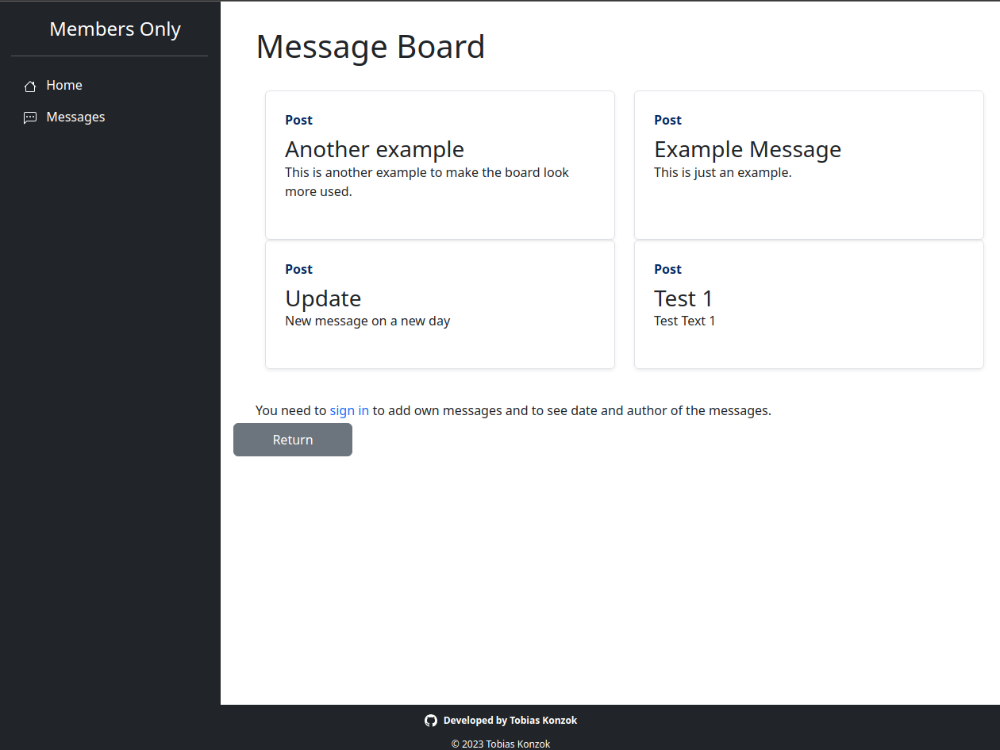

<h1 align="center">Members Only</h1>

Part of Odin Project Node.js course to practise using Express, MongoDB and user authorization with express-session, passport and bcrypt. The task was to build an exclusive clubhouse where your members can write anonymous posts. Inside the clubhouse, members can see who the author of a post is, but outside they can only see the story and wonder who wrote it.

<h2>Demo</h2>

[Live Demo](https://tkonzok-odin-members-only.fly.dev/)

<h2>Built with</h2>

- Node.js
- Express.js
- MongoDB

 

<h2>Features</h2>

- Message board, fetching latest messages from MongoDB database and listing them
- Sign Up section to sign up with name, username and password. User will be saved to database
- Sign In section to sign in with valid user
- Ability to add new messages to the board only when signed in
- Ability to view author and date of all messages only when signed in
- Become admin by entering a secret key. Only admins are able to delete messages
- Focus on function of the app. Therefore simple styling applied with the help of Bootstrap
